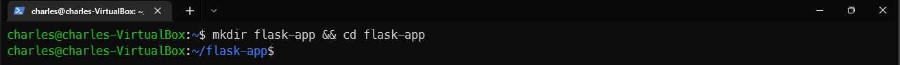
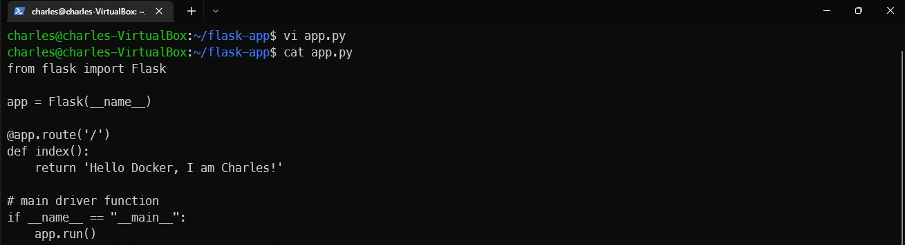
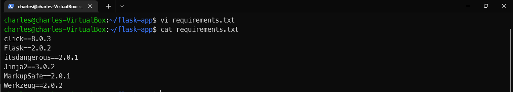
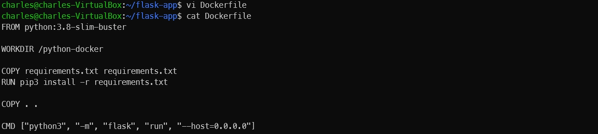
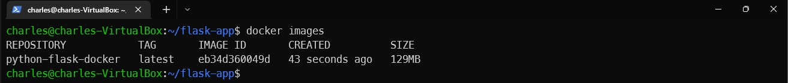
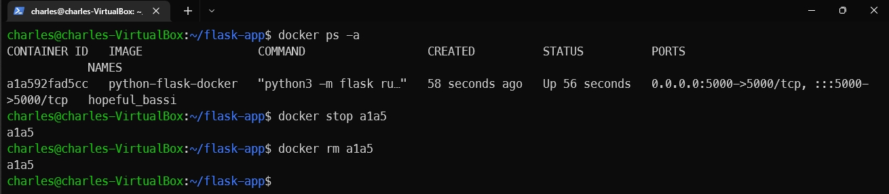
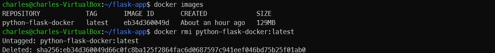

In this lab, you will learn how to dockerize a Python Flask app.

1. Create a folder named `flask-app` and use the `cd` command to navigate to the folder.

```
mkdir flask-app && cd flask-app
```



2. Create a file and name it `app.py`. Copy the following content into the `app.py` file.

```

from flask import Flask

app = Flask(__name__)

@app.route('/')
def index():
    return 'Hello to Flask!'

# main driver function
if __name__ == "__main__":
    app.run()
```



3. Create a file and name it `requirements.txt`. Copy the following content into the `requirements.txt` file.

```
click==8.0.3
Flask==2.0.2
itsdangerous==2.0.1
Jinja2==3.0.2
MarkupSafe==2.0.1
Werkzeug==2.0.2
```



4. Create a `Dockerfile` and copy the following content into the `Dockerfile`.

```
FROM python:3.8-slim-buster

WORKDIR /python-docker

COPY requirements.txt requirements.txt
RUN pip3 install -r requirements.txt

COPY . .

CMD [ "python3", "-m" , "flask", "run", "--host=0.0.0.0"]
```

Explain about this Dockerfile:
- `FROM python:3.8-slim-buster`: Create a new Docker image based on the Python 3.8 slim buster image

- `WORKDIR /python-docker`: we're telling Docker to use the same directory and name for the rest of its operations. 

- `COPY requirements.txt requirements.txt`: Copy the contents of our requirements.txt file into the container image's requirements.txt file.

- `RUN pip3 install -r requirements.txt`: Run pip install to install all the dependencies in the same file to be used by the image.

- `COPY . .`: Copy the remainder of the files in our local working directory to the directory in the docker image.

- `CMD [ "python3", "-m" , "flask", "run", "--host=0.0.0.0"]`: This line specifically instructs Docker to run our Flask app as a module, as indicated by the `-m` tag.



5. Now, our working directory will look like this:

```
flask-app
├── app.py
├── Dockerfile
├── requirements.txt
```

6. Run the following command to build our image based on the instruction from the `Dockerfile`.

```
docker build -t python-flask-docker .
```


7. After you run the command, the terminal will output something like below:

```
 => [internal] load build definition from Dockerfile                                                                      0.0s
 => => transferring dockerfile: 238B                                                                                      0.0s
 => [internal] load metadata for docker.io/library/python:3.8-slim-buster                                                 3.3s
 => [internal] load .dockerignore                                                                                         0.0s
 => => transferring context: 2B                                                                                           0.0s
 => [1/5] FROM docker.io/library/python:3.8-slim-buster@sha256:8799b0564103a9f36cfb8a8e1c562e11a9a6f2e3bb214e2adc23982b  52.5s
 => => resolve docker.io/library/python:3.8-slim-buster@sha256:8799b0564103a9f36cfb8a8e1c562e11a9a6f2e3bb214e2adc23982b3  0.2s
 => => sha256:8799b0564103a9f36cfb8a8e1c562e11a9a6f2e3bb214e2adc23982b36a04511 988B / 988B                                0.0s
 => => sha256:90834dba6381dfc3957573dc7a3e6c5c8ed255cf60079329a6da2b5e6d4257b8 1.37kB / 1.37kB                            0.0s
 => => sha256:addd6962740ab9fd79a788945daa24348c11adcec97d47a647e0a61c86cc9f60 6.87kB / 6.87kB                            0.0s
 => => sha256:8b91b88d557765cd8c6802668755a3f6dc4337b6ce15a17e4857139e5fc964f3 27.14MB / 27.14MB                         46.8s
 => => sha256:824416e234237961c9c5d4f41dfe5b295a3c35a671ee52889bfb08d8e257ec4c 2.78MB / 2.78MB                           10.4s
 => => sha256:8f777578c172d018077d3dc22d6654911fff60066097943fe8c4697ecf8aac35 12.89MB / 12.89MB                         37.0s
 => => sha256:cbfea27109a8b1136059a7973ccb8243889faf162ebc173a05909dcb0bec03c9 244B / 244B                               11.3s
 => => sha256:276dfcf5deffff3c5d540a8e0d9a18656a4c03637a8b4f4eec1f4a147799c901 3.14MB / 3.14MB                           22.4s
 => => extracting sha256:8b91b88d557765cd8c6802668755a3f6dc4337b6ce15a17e4857139e5fc964f3                                 3.1s
 => => extracting sha256:824416e234237961c9c5d4f41dfe5b295a3c35a671ee52889bfb08d8e257ec4c                                 0.3s
 => => extracting sha256:8f777578c172d018077d3dc22d6654911fff60066097943fe8c4697ecf8aac35                                 1.2s
 => => extracting sha256:cbfea27109a8b1136059a7973ccb8243889faf162ebc173a05909dcb0bec03c9                                 0.0s
 => => extracting sha256:276dfcf5deffff3c5d540a8e0d9a18656a4c03637a8b4f4eec1f4a147799c901                                 0.6s
 => [internal] load build context                                                                                         0.1s
 => => transferring context: 599B                                                                                         0.0s
 => [2/5] WORKDIR /python-docker                                                                                          0.6s
 => [3/5] COPY requirements.txt requirements.txt                                                                          0.1s
 => [4/5] RUN pip3 install -r requirements.txt                                                                           11.1s
 => [5/5] COPY . .                                                                                                        0.2s
 => exporting to image                                                                                                    0.6s
 => => exporting layers                                                                                                   0.5s
 => => writing image sha256:eb34d360049d66c0fc8ba125f2864fac6d0687597c941eef046bd75b25f01ab0                              0.0s
 => => naming to docker.io/library/python-flask-docker
```

8. We can check out our newest image by using `docker images` command.

```
docker images
```



9. Now, run the following command to run a container based on our image:

```
docker run -d -p 5000:5000 python-flask-docker
```


10. To check the content of the container we can use `curl`.

```
curl localhost:5000
```


11. Following these steps to remove the container and image



