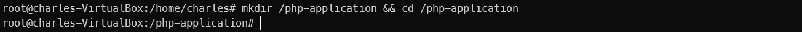
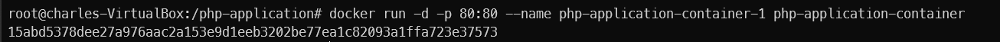

On this task, you will deploy a PHP welcome page that greet visitors based on the date and time. 
Your task is to dockerize the PHP application given here, using the Apache web server installed an Ubuntu base image.

1. Create a folder named `php-application` and navigate to its using `cd` command.

```
mkdir /php-application && cd /php-application
```



2. Create a `welcome.php` file with the `touch` command.

```
touch welcome.php
```


3. Copy and paste the following code into the `welcome.php` file.

```
<?php

$hourOfDay = date('H');

if ($hourOfDay < 12) {
	$message = "Good Morning";
} elseif($hourOfDay > 11 && $hourOfDay < 18) {
	$message = "Good Afternoon";
} elseif($hourOfDay > 17){
	$message = "Good Evening";
}

echo $message;

?>
```


4. Create a Dockerfile  with the following code:

```
# Pull Ubuntu base image with tag 18.04
FROM ubuntu:18.04

# Set non-interactive frontend
ENV DEBIAN_FRONTEND=noninteractive

# Install Apache, PHP and necessary dependencies
RUN apt-get update && \
		apt-get -y install apache2 \
		php libapache2-mod-php && \
    apt-get clean && \
    rm -rf /var/lib/apt/lists/*

# Copy the welcome.php file to the Docker image		
COPY welcome.php /var/www/html

# Set working directory
WORKDIR /var/www/html

# Expose Apache
EXPOSE 80

# Start Apache
ENTRYPOINT ["apache2ctl", "-D", "FOREGROUND"]
```


5. Now, build the Docker image using the following command:

```
docker build -t php-application-container .
```


6. Let’s run a Docker container based on the image we just created using the instructions from the Dockerfile.

```
docker run -d -p 80:80 --name php-application-container-1 php-application-container 
```



7. You can test your web server by using the `curl` command or typing `http://127.0.0.1/welcome.php` in your favorite web browser.

```
curl http://127.0.0.1/welcome.php
```


8. Follow these step to remove the container and image.


