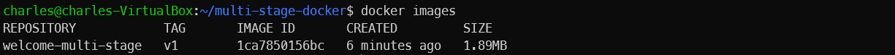

# Introduction to Multi-Stage Dockerfiles

`Multi-Stage` Dockerfiles are a feature introduced in Docker version 17.05.

This feature is `preferable` when we want to focus solely on `optimizing Docker image size` while running Docker images in `production environments`.
- To achieve this, a multi-stage Dockerfile will create `multiple intermediate Docker images` during the **build process** and selectively copy only `essential artifacts` from **one stage** to **another**.

Before multi-stage Docker builds were introduced, the builder pattern was used to optimize the Docker image size. Unlike multi-stage builds, the builder pattern needs `two Dockerfiles` and a shell script to create efficient Docker images.

## What is the builder pattern?
The `builder pattern` is a method used to create optimally sized Docker images.
- It uses **two Docker images** and selectively copies `essential artifacts` from one to the other

The **first Docker image** is known as the `build image` and is used as the `build environment` to build the executables from the source code.
- This Docker image contains `compilers`, `build tools`, and `development dependencies required` during the build process

The **second Docker image** is known as the `runtime image` and is used as the `runtime environment` to run the executables created by the `first Docker container`
- This Docker image contains only the `executables`, the `dependencies`, and the `runtime tools`

-> A shell script is used to `copy the artifacts` using the `docker container cp` command.

The entire process of building the image using the `builder pattern` consists of the following steps:
1. Create the `Build` Docker iamge
2. Create a container from the `Build` Docker image
3. Copy the `artifacts` from the `Build` Docker iamge to the local filesystem
4. Build the Runtime Docker image using copied artifacts


The builder Dockerfile is used to create the build container that will contain all the tools required to build the source code, including `compilers`, `build tools`, and `development dependencies`.

Once the build container is created, the shell script will copy the executables from the build container to the Docker host.

Finally, the Runtime container will be created with the executables copied from the Build container.

## Building a Docker image with the builder pattern
You have been asked to create a minimal-sized Docker image to run the application.

In this lab, you will **optimize** the Docker image using the `builder pattern`.

1. Make a directory named `builder-pattern` and navigate into it.

```
cd builder-pattern && cd builder-pattern
```


2. Create a file named `hellogo.po` with the following content:

```
package main

import "fmt"

func main() {
	fmt.Println("Hello Go, my name is Charles")
}
```


3. Create a file named `Dockerfile.build`. This Dockerfile is used to create the `build Docker container` with the following content:

```
# Start from latest golang parent image
FROM golang:latest

# Set the working directory inside the container
WORKDIR /myapp

# Copy source code from current directory to container
COPY hellogo.go .

# Build the Go app
RUN go build -o hellogo hellogo.go

# Start the application
ENTRYPOINT ["./hellogo"]
```


4. Create a file named `Dockerfile.runtime`. This Dockerfile is used to build the `runtime Docker container` with the following content:

```
# Start from latest alpine parent image
FROM alpine:latest

# Set the working directory
WORKDIR /myapp

# Copy the hellogo app from current directory to container
COPY hellogo .

# Start the application
ENTRYPOINT ["./hellogo"]
```

This **hellogo** artifact is the result of the `go build -o hellogo hellogo.go` command executed in the first Dockerfile named `Dockerfile.build`.

5. Next, we will be using a shell script to copy the artifact from the `build Docker container` to the local filesystem, from where this artifact will be copied to the `runtime Docker image`. Create a shell script file named `setup_builder_pattern.sh` and copy the following code into the file.

```
#!/bin/bash

# Build the builder Docker image using the Dockerfile nmaed Dockerfile.build
docker build -t hellogo-build -f Dockerfile.build .

# docker container create or docker create
# Create a container from the build Docker image
docker create --name hellogo-build-container hellogo-build

# Copy build artifacts from the container to the local filesystem
docker cp hellogo-build-container:/myapp/hellogo .

# Build the runtime Docker image using the Dockerfile named Dockerfile.runtime
docker build -t hellogo -f Dockerfile.runtime .

# Remove the builder Docker container
docker rm -f hellogo-build-container

# Remove the copied artifacts
rm hellogo
```


This shell script will first build the `hellogo-build` Docker image using the `Dockerfile.build` file. The next step is to create a Docker container from the `hellogo-build` image so that we can copy the `hellogo` artifact to the Docker host. 

Once the container is created, we need to execute the command to copy the `hellogo` artifact from the hellogo-build-container to the current directory of the Docker host

Now, we can build the runtime container with the `docker build` command. 

Finally, we will execute the necessary cleanup tasks by removing the intermediate **artifacts**, such as the `hellogo-build-container` container and the `hellogo` executable.

6. To execute the script, you need to add execution to the `setup_builder_pattern.sh` shell script by using the following command:

```
chmod +x setup_builder_pattern.sh
```


7. Now that you have the two Dockerfiles and the shell script, build the Docker image by executing the `setup_builder_pattern.sh` shell script:

```
./setup_builder_pattern.sh
```


8. Once we execute the shell script, we would be able to see two Docker iamges using `docker images` command.
- Note the size difference between the two Docker images. The `hellogo` Docker image is only **9.69** MB in size, which is a huge reduction from the `hellogo-build` image at **851** MB.

```
docker images
```


As we can see, the builder pattern can drastically reduce the size of the Docker images by copying only the essential artifacts to the final image. However, the `disadvantage` with the builder pattern is that we need to maintain `two Dockerfiles` and a `shell script`.

9. Follow these step to remove the images.

  

# Introduction to Multi-Stage Dockerfiles

`Multi-stage Dockerfiles` are a feature that allows for a `single Dockerfile` to **contain multiple stages** that can produce optimized Docker images.

Multi-stage Dockerfiles will use `multiple FROM` directives within the Dockerfile for each stage, and each stage will start with a **different base image**.

Multi-stage Docker builds allow us to create **minimal-sized** Docker images that are similar to the builder pattern but eliminate the problems associated with it.

The `main difference` between a `normal` Dockerfile and a `multi-stage` Dockerfile is that a multi-stage Dockerfile will use **multiple FROM** directives to build each phase.

## Building a Docker image with a multi-stage Docker Build
In this lab, you are going to use a multi-stage Dockerfile to eliminate this operational burden.

1. Create a folder named `multi-stage-docker` and navigate into it.

``` 
mkdir multi-stage-docker && cd multi-stage-docker
```


2. Create a file named `welcome.go` with the following code:

```
package main

import "fmt"

func main() {
	fmt.Println("Welcome Charles to the Multi-Stage Dockerfiles")
}
```


3. Create a Dockerfile with the following code:

```
FROM golang:latest AS builder
WORKDIR /myapp
COPY welcome.go .
RUN go build -o welcomego welcome.go

FROM sratch 
WORKDIR /myapp
COPY --from=builder /myapp/welcomego .
ENTRYPOINT ["./welcomego"]
```


This `multi-stage` Dockerfile uses the latest golang image as the parent image and this stage is named `builder`. Next, the `/myapp` directory is specified as the working directory. Then, the `COPY` directive is used to copy the **welcome.go** source file and the `RUN` directive is used to build the golang file.

In the next stage, we use the `scratch` image as the parent image the parent image. The `WORKDIR` will set the /myapp directory as the current working directory of the Docker image. Then, the `COPY` directive is used to copy the `welcomego` executable from the builder stage to this stage. Finally, the `ENTRYPOINT` directive is used to execute the `welcomego` command.

4. Now, we will be using `docker build` command to build our image based on the instructions in the Dockerfile.

```
docker build -t welcome-multi-stage:v1 .
```


5. Use the docker images command to list the Docker image available on your computer.



6. Following these steps to remove the image.


You can notice that the size of the Docker image, which is built using the multi-stage, has been decreased incredibly on the size.

# Conclusion
In this section, you have learned how to build optimized Dockerfile images using `builder pattern` or `multi-stage`.

The following table presents a summary of the key differents between the builder pattern and multi-stage:

| Builder Pattern                       | Multi-Stage		   |
| -------------------------------------:| --------------------:|
| Need to maintain a shell script and two Dockerfiles   | Needs only one Dockerfiles |
| Need to copy the executables to the Docker host before copying them to the final Docker image | Can use the --from flag to copy the executables between stages without copying them to the Docker host |

You can view the [best practices](DockerfileBestPractices.md) for building a Dockerfile.