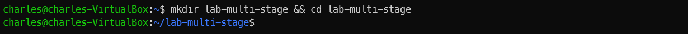
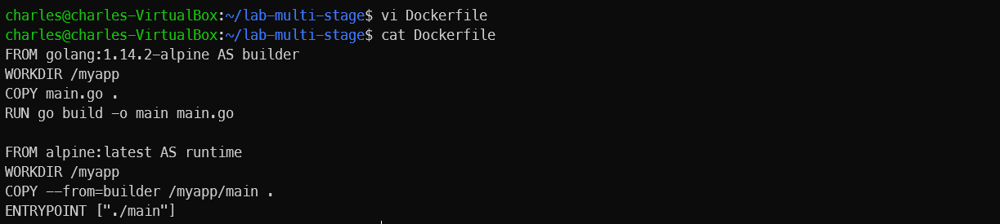
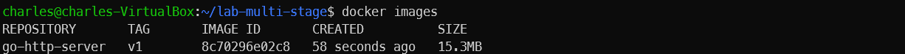
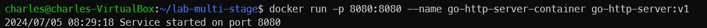
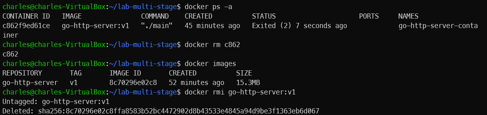

# Deploying a Golang HTTP Server with a Multi-Stage Docker Build
Let's test our knowledge by deploying a Golang HTTP Server with a multi-stage Docker build in this lab.

This Golang HTTP server will return different responses based on the invoke URL:
| Invoke URL | Message |
| ----------:|--------:|
| http://127.0.0.1:<port>/ | Home Page |
| http://127.0.0.1:<port>/login | Contact Us |
| http://127.0.0.1:<port>/contact | Login Page |

1. Create a directory named `multi-stage` and navigate into it.

```
mkdir multi-stage && cd multi-stage
```



2. Create a file named `main.go` with the following code:

```
package main

import (
	"fmt"
	"log"
	"net/http"
	"os"
)

func main() {
	http.HandleFunc("/", defaultHandler)
	http.HandleFunc("/contact", contactHandler)
	http.HandleFunc("/login", loginHandler)
	port := os.Getenv("PORT")
	if port == "" {
		port = "8080"
	}
	log.Println("Service started on port " + port)
	err := http.ListenAndServe(":"+port, nil)
	if err != nil {
		log.Fatal("ListenAndServe: ", err)
		return
	}
}
func defaultHandler(w http.ResponseWriter, r *http.Request) {
	fmt.Fprintf(w, "<h1>Home Page</h1>")
}
func contactHandler(w http.ResponseWriter, r *http.Request) {
	fmt.Fprintf(w, "<h1>Contact Us</h1>")
}
func loginHandler(w http.ResponseWriter, r *http.Request) {
	fmt.Fprintf(w, "<h1>Login Page</h1>")
}
```

3. In the same folder, create a file named `Dockerfile` with the following code:

```
FROM golang:1.14.2-alpine AS builder
WORKDIR /myapp
COPY main.go .
RUN go build -o main main.go

FROM alpine:latest AS runtime
WORKDIR /myapp
COPY --from=builder /myapp/main .
ENTRYPOINT [ "./main" ]
```



This `Dockerfile` has **two stages**, named `builder` and `runtime` 
- The builder stage uses the Golang image as the parent image and is responsible for creating the executable from the Golang source file.
- The runtime stage uses the alpine image as the parent image and executes the executable file copied from the builder stage.

4. Now, let's build the Docker image using the `docker build` command:

```
docker build -t go-http-server:v1 .
```

You should get the following output:

```
 => [internal] load build definition from Dockerfile                                                               0.0s
 => => transferring dockerfile: 237B                                                                               0.0s
 => [internal] load metadata for docker.io/library/alpine:latest                                                   2.2s
 => [internal] load metadata for docker.io/library/golang:1.14.2-alpine                                            4.3s
 => [internal] load .dockerignore                                                                                  0.0s
 => => transferring context: 2B                                                                                    0.0s
 => [builder 1/4] FROM docker.io/library/golang:1.14.2-alpine@sha256:9b3ad7928626126b72b916609ad081cfb6c0149f6e  135.1s
 => => resolve docker.io/library/golang:1.14.2-alpine@sha256:9b3ad7928626126b72b916609ad081cfb6c0149f6e60cef7fc1e  0.1s
 => => sha256:cbdbe7a5bc2a134ca8ec91be58565ec07d037386d1f1d8385412d224deafca08 2.81MB / 2.81MB                     2.3s
 => => sha256:408f875501273f3af2a9cbff2a23e736585641e73da80dd81712518b28e7843c 301.28kB / 301.28kB                 1.8s
 => => sha256:fe522b08c9798748151fec9b7a908aca712cd102cfcbb8ed79d57d05b71e6cc4 153B / 153B                         2.0s
 => => sha256:9b3ad7928626126b72b916609ad081cfb6c0149f6e60cef7fc1e9e15a0d1e973 1.65kB / 1.65kB                     0.0s
 => => sha256:b0678825431fd5e27a211e0d7581d5f24cede6b4d25ac1411416fa8044fa6c51 1.36kB / 1.36kB                     0.0s
 => => sha256:dda4232b2bd580bbf633be12d62e8d0e00f6b7bd60ea6faee157bad1809c53c4 3.83kB / 3.83kB                     0.0s
 => => sha256:618fff1cf170e1785ab64028237182717bc1e1287d03cf0888e424b7563ae5df 132.01MB / 132.01MB               121.0s
 => => sha256:0d8b518583db0dc830a3a43c739d6cc91b7610c09d9eba918ae54b20a1dcd18c 126B / 126B                         3.7s
 => => extracting sha256:cbdbe7a5bc2a134ca8ec91be58565ec07d037386d1f1d8385412d224deafca08                          0.2s
 => => extracting sha256:408f875501273f3af2a9cbff2a23e736585641e73da80dd81712518b28e7843c                          0.1s
 => => extracting sha256:fe522b08c9798748151fec9b7a908aca712cd102cfcbb8ed79d57d05b71e6cc4                          0.0s
 => => extracting sha256:618fff1cf170e1785ab64028237182717bc1e1287d03cf0888e424b7563ae5df                         13.6s
 => => extracting sha256:0d8b518583db0dc830a3a43c739d6cc91b7610c09d9eba918ae54b20a1dcd18c                          0.0s
 => [runtime 1/3] FROM docker.io/library/alpine:latest@sha256:b89d9c93e9ed3597455c90a0b88a8bbb5cb7188438f70953fed  0.0s
 => CACHED [runtime 2/3] WORKDIR /myapp                                                                            0.0s
 => [internal] load build context                                                                                  0.0s
 => => transferring context: 831B                                                                                  0.0s
 => [builder 2/4] WORKDIR /myapp                                                                                   0.7s
 => [builder 3/4] COPY main.go .                                                                                   0.1s
 => [builder 4/4] RUN go build -o main main.go                                                                     3.2s
 => [runtime 3/3] COPY --from=builder /myapp/main .                                                                0.2s
 => exporting to image                                                                                             0.2s
 => => exporting layers                                                                                            0.1s
 => => writing image sha256:8c70296e02c8ffa8583b52bc4472902d8b43533e4845a94d9be3f1363eb6d067                       0.0s
 => => naming to docker.io/library/go-http-server:v1
```

5. Use the docker images command to list the Docker images available on your computer:

```
docker images
```



You can notice that the size of the Docker image named `go-http-server` is 15.3 MB.

6. Execute the `docker run` command to start a new Docker container from the Docker image that you built in the previous step:

```
docker run -p 8080:8080 --name go-http-server-container go-http-server:v1
```

You should get an output similar to the following:
```
2024/07/05 08:29:18 Service started on port 8080
```



7. You can view the application by opening your favorite web browser and type the following URL:

```
http://127.0.0.1:8080/
```

```
http://127.0.0.1:8080/login
```

```
http://127.0.0.1:8080/contact
```

8. We have learned how to deploy a Golang HTTP server that can return different responses based on the invoke URL. Following these steps to delete our container and image

