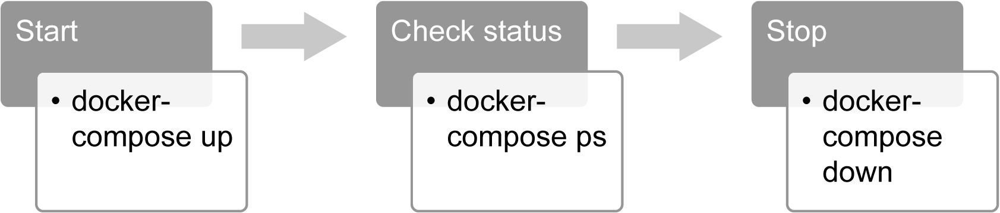
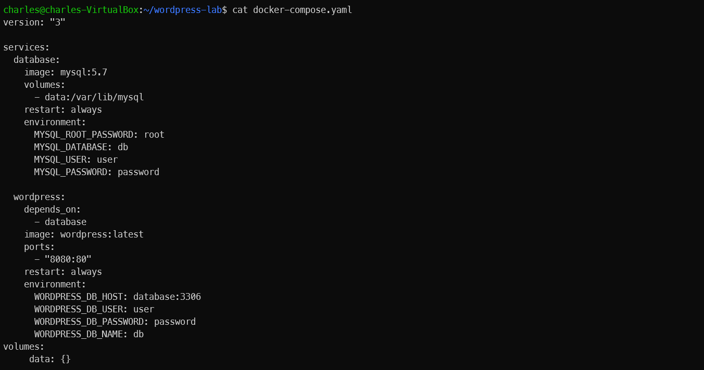
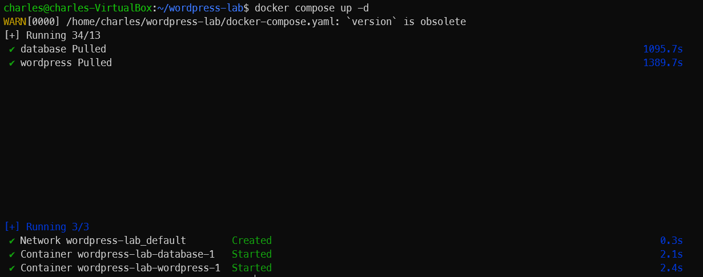
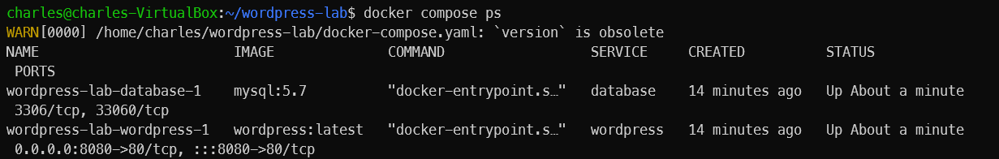
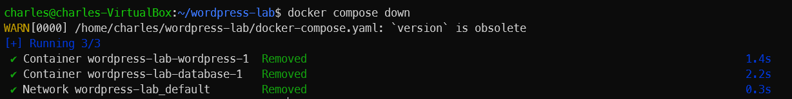
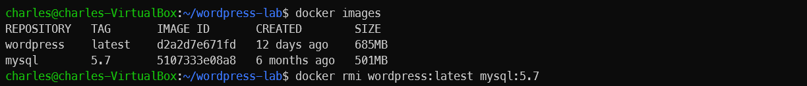

# What is Docker Compose
Docker Compose is a tool for defining and running `multi-container` applications.

- It's important to understand that Compose is a `declarative` tool - you simply define it and go. It is suitable for various environments, including development, testing, Continuous Integration (CI) pipelines, and production.

The essential features of Docker Compose can be grouped into three categories:
- Isolation: Docker Compose allows you to run **multiple instances** of your complex application in complete isolation. Therefore, sharing resources increasesutilization while decreasing operational complexity
- Stateful data management: Docker Compose manages the volumes of your containers so that they do not lose their data from previous runs. This feature makes it easier to create and operate applications that store their state on disks, such as databases.
- Iterative design: Docker Compose works with an explicitly defined configuration that consists of multiple containers

These features make Compose an essential tool for creating and managing applications as multiple containers in various platforms. In this part, you will see how Docker Compose helps you to manage the complete life cycle of complicated applications.

There are `three essential` docker-compose commands that are used to manage the life cycle of applications.

The life cycle and commands can be illustrated as follows:



- docker-compose up: This command `creates` and `starts` the containers defined in the configuration
- docker-compose ps: This command `lists` the containers and their status information. It is **helpful** for `troubleshooting` and container `health checks`.
- docker-compose down: This command `stops` and `removes` all the resources, including containers, networks, images, and volumes

## What is Docker Compose file?
Multi-container applications are run and defined using the docker-compose CLI.

By convention, the default name of these files is `docker-compose.yaml`
- `docker-compose.yml` and `docker-compose.yaml` are the same thing.

`docker-compose.yml` files consist of four main section:
- version: This section `defines` the `syntax version` for the docker-composefile, and currently, the **latest syntax** version is **3**.
- services: This section `describes` the Docker containers that will be built if needed and will be started by docker-compose.
- networks: This section `describes` the `networks` that will be used by the services
- volumes: This section `describes` the `data volumes` that will be mounted to the
containers in services

For the services section, there are two essential options to create containers. 
- The first option is to build the container
- The second is to use Docker images from the registry

When you are creating and testing containers locally, it is **advisable** to build the images. On the other hand, it is faster and easier to use Docker images from the registry for production and CI/CD systems.

# Getting Started With Docker Compose
You are assigned to design and deploy a blog with its database as microservices in Docker.

Also, the development and testing teams require the installation of both WordPress and the database multiple times on different platforms with isolation. Therefore, you are required to design it as a Docker Compose application and manage it with the `docker-compose` CLI.

Let's begin the lab.

1. Create a directory named `wordpress-lab` for our `docker-compose.yaml` file.

```
mkdir wordpress-lab && cd wordpress-lab
```


2. Create a `docker-compose.yaml` file with the following code:

```
version: "3"

services:
  datbase:
    image: mysql:5.7
    volumes: 
      - data:/var/lib/mysql
    environment: 
      MYSQL_ROOT_PASSWORD: root
      MYSQL_DATABASE: mydb
      MYSQL_USER: user
      MYSSQL_PASSWORD: password

  wordpress:
    image: wordpress:latest
    ports: 
      - 8080:80
    restart: always
    environment: 
      WORDPRESS_DB_HOST: database:3306
      WORDPRESS_DB_USER: user
      WORDPRESS_DB_PASSWORD: password
      WORDPRESS_DB_NAME: mydb
volumes:
     data:
```



In this `docker-compose.yaml` file, we have two services called `database` and `wordpress`.

The service for database using `MYSQL` and a volume defined in the `docker-compose.yaml` file.
- Ensure that the **MYSQL_ROOT_PASSWORD**, **MYSQL_DATABASE**, **MYSQL_USER**, and **MYSQL_PASSWORD** `environment variables` are set.

The service for Wordpress defined in the `docker-compose.yaml` file.
- Ensure that the WordPress containers start **after** the database.
- Ensure that the **WORDPRESS_DB_HOST**, **WORDPRESS_DB_USER**, **WORDPRESS_DB_PASSWORD**, and **WORDPRESS_DB_NAME** `environment variables` are set.

3. Start the Docker Compose application by running the following command:

```
docker compose up -d
```



4. Check for the running containers with the `docker-compose ps` command.
- You should get the following output:



5. Next, you open your favorite web browser and type the following URL to check the WordPress setup screen:

```
http://localhost:8080
```

6. Now, use the `docker compose down` command to stop and remove all the resources associated with a Docker Compose application. This includes stopping all running containers defined in the docker-compose.yml file, removing the containers, and optionally removing networks and volumes created by the docker-compose up command.

```
docker compose down
```



7. Following these step to remove the image.



# Summary
This part focuses on how you can use Docker Compose to design, create, and manage `multi-container` applications. The complexity of containerized applications has increased with the rise of the microservice architecture. Thus, it has become difficult to create, manage, and troubleshoot multi-container applications without the appropriate tooling.
