# Introduction to Docker Swarm
Docker Swarm is an advanced feature for managing a Cluster of Docker deamons. Docker Swarm allows you to setup multiple servers running Docker Engine and organize them as a cluster. Swarm will configure your cluster to make sure your services are balanced across your cluster, ensuring higher reliability for your services.

Also, It allows you to configure redundancy and failover for your services while scaling the number of containers up and down depending on the load. You can perform rolling updates across your services to reduce the chances of an outage, meaning new versions of your container applications can be applied to the cluster without these changes causing an outage for your customers. It will allow you to orchestrate your container workloads through the swarm instead of manually managing containers one by one.

There are some components you need to know when using Docker Swarm:
- Swarm
- Task
- Service
- Node
    - Manager nodes
    - Worker nodes  

## Swarm
A swarm consists of multiple Docker hosts which run in Swarm mode and act as managers, to manage membership and delegation, and workers, which run swarm services. 

Having multiple nodes and workers is not compulsory as part of Docker Swarm. You can run your services as a single node swarm, which is the way we will be working in this chapter, even though a production cluster may have multiple nodes available to make sure your services are as fault-tolerant as possible.

## Task
A task consists of a Docker container and the commands that will run inside the container. A task carries a Docker container and the commands to run inside the container. It is the atomic scheduling unit of swarm. Manager nodes assign tasks to worker nodes according to the number of replicas set in the service scale. Once a task is assigned to a node, it cannot move to another node. It can only run on the assigned node or fail

## Service
A service is the definition of the tasks to execute on the manager or worker nodes. It is the central structure of the swarm system and the primary root of user interaction with the swarm.

## Node
A node is an instance of the Docker engine participating in the swarm. You can also think of this as a Docker node. You can run one or more nodes on a single physical computer or cloud server

To deploy your application to a swarm, you submit a **service definition** to a **manager node**. The manager node dispatches units of work called **tasks** to **worker nodes**.

So there are two type of nodes: **managers** and **workers** 

### Manager nodes
The manager dispatches tasks to worker nodes. Manager nodes handle cluster management tasks:
- Maintaining cluster state
- Scheduling services
- Serving Swarm mode HTTP API endpoints

To take advantage of Swarm mode's fault-tolerance features, we recommend you implement an odd number of nodes according to your organization's high-availability requirements. When you have multiple managers you can recover from the failure of a manager node without downtime.
- A three-manager swarm tolerates a maximum loss of one manager.
- A five-manager swarm tolerates a maximum simultaneous loss of two manager nodes.
- An odd number N of manager nodes in the cluster tolerates the loss of at most (N-1)/2 managers. Docker recommends a maximum of seven manager nodes for a swarm.

### Worker nodes
Worker nodes are also instances of Docker Engine whose sole purpose is to execute containers. Worker nodes don't participate in the Raft distributed state, make scheduling decisions, or serve the swarm mode HTTP API.
Worker nodes execute the tasks assigned by the manager node.

# How Docker Swarm works?

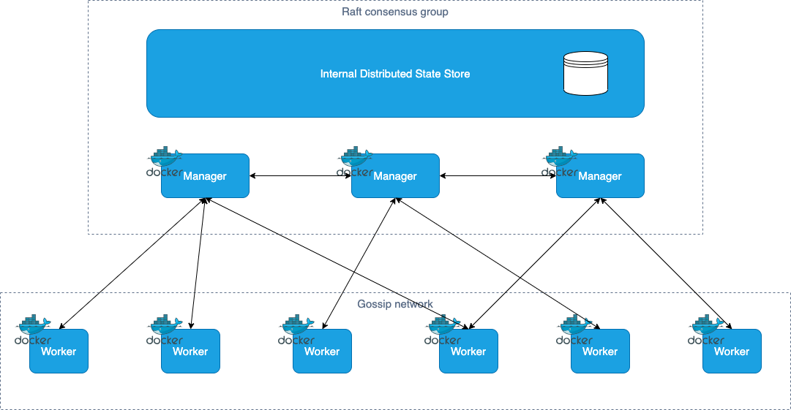


## How nodes work?
There are two type of nodes: **managers** and **workers** 

### Manager nodes
Manager nodes handle cluster management tasks:
- Maintaining cluster state

- Scheduling services

- Serving Swarm mode HTTP API Endpoints

To take advantage of Swarm mode's fault-tolerance features, we recommend you implement an **odd number of nodes** according to your organization's high-availability requirements. When you have multiple managers you can recover from the failure of a manager node without downtime.
- A three-manager swarm tolerates a maximum loss of one manager.

- A five-manager swarm tolerates a maximum simultaneous loss of two manager nodes

- An odd number N of manager nodes in the cluster tolerates the loss of at most (N-1)/2 managers. Docker recommends a maximum of seven manager nodes for a swarm.

### Worker nodes
Worker nodes are also instances of Docker Engine whose sole purpose is to execute containers.

# How services work?
To deploy an application image when Docker Engine is in Swarm mode, you create a service. Frequently a service is the image for a microservice within the context of some larger application. Examples of services might include an HTTP server, a database, or any other type of executable program that you wish to run in a distributed environment.

When you create a service, you specify which container image to use and which commands to execute inside running containers. You also define options for the service including:
- The port where the swarm makes the service available outside the swarm

- An overlay network for the service to connect to other services in the swarm

- CPU and memory limits and reservations

- A rolling update policy

- The number of replicas of the image to run in the swarm

## Services, tasks and containers
When you deploy the service to the swarm, the swarm manager accepts your service definition as the desired state for the service. Then it schedules the service on nodes in the swarm as one or more replica tasks. The tasks run independently of each other on nodes in the swarm.

A container is an isolated process. In the Swarm mode model, each task invokes exactly one container. A task is analogous to a “slot” where the scheduler places a container. Once the container is live, the scheduler recognizes that the task is in a running state. If the container fails health checks or terminates, the task terminates.

## Tasks and scheduling
A task is the atomic unit of scheduling within a swarm. When you declare a desired service state by creating or updating a service, the orchestrator realizes the desired state by scheduling tasks. 

For instance, you define a service that instructs the orchestrator to keep three instances of an HTTP listener running at all times. The orchestrator responds by creating three tasks. Each task is a slot that the scheduler fills by spawning a container. The container is the instantiation of the task. If an HTTP listener task subsequently fails its health check or crashes, the orchestrator creates a new replica task that spawns a new container.

A task is a one-directional mechanism. It progresses monotonically through a series of states: 
- assigned

- prepared 

- running

- etc

If the task **fails**, the orchestrator removes the task and its container and then creates a new task to replace it according to the desired state specified by the service.

The underlying logic of Docker's Swarm mode is a general purpose **scheduler** and **orchestrator**. 

The diagram below shows how Swarm mode accepts service create requests and schedules tasks to worker nodes.


## Pending services
A service may be configured in such a way that no node currently in the swarm can run its tasks. In this case, the service remains in state **pending**. Here are a few examples of when a service might remain in state pending.

- If all nodes are paused or drained, and you create a service, it is pending until a node becomes available. In reality, the first node to become available gets all of the tasks, so this is not a good thing to do in a production environment.

- You can reserve a specific amount of memory for a service. If no node in the swarm has the required amount of memory, the service remains in a pending state until a node is available which can run its tasks. If you specify a very large value, such as 500 GB, the task stays pending forever, unless you really have a node which can satisfy it.

- You can impose placement constraints on the service, and the constraints may not be able to be honored at a given time.

## Replicated and global services
There are two types of service deployments:
- replicated 
- global

**Replicated** service: You specify **the number of identical tasks** you want to run.

**Global** service: A global service is a service that runs one task on every node. There is **no pre-specified number of tasks**. Each time you add a node to the swarm, the orchestrator creates a task and the scheduler assigns the task to the new node. Good candidates for global services are monitoring agents, anti-virus scanners or other types of containers that you want to run on every node in the swarm.

The diagram below shows a three-service replica in gray and a global service in black.

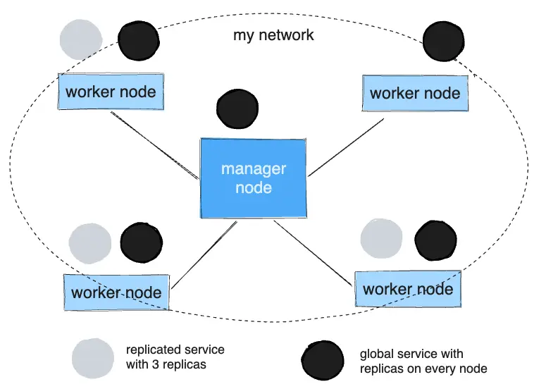

# Lab1: Running services with Docker Swarm
This lab is designed to help you become familiar with using the Docker Swarm commands to manage your services and containers. In this lab, you will activate a cluster, set up a new service, test scaling up the service, and then remove the service from the cluster using Docker Swarm.

1. Use the **docker swarm init command** to put your local system into Docker Swarm mode

```
docker swarm init
```

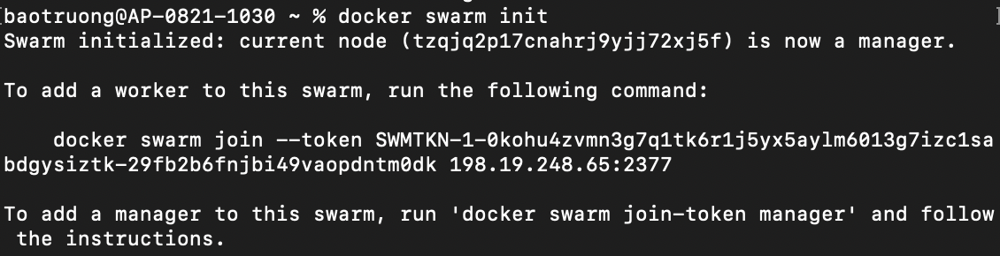

2. Now list the nodes you have in your cluster, using the **node ls** command:

```
node ls 
```

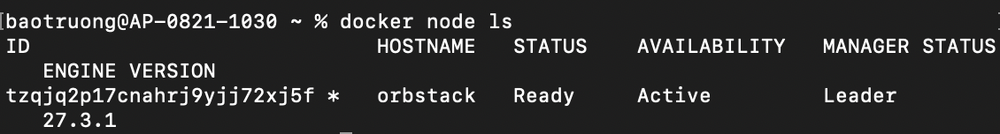

You should have one node you are currently working on and its status should be **Ready**

3. From your node, check the status of your swarm using the **docker info command**, providing further details of your Swarm cluster and how the node is interacting with it. It will also give you extra information if you need to troubleshoot issues later:

```
docker info
```

4. Start your first service on your newly created swarm. Create a service named web using the d**ocker service create command** and the --replicas option to set two instances of the container running:

```
docker service create --replicas 2 -p 80:80 --name web nginx
```

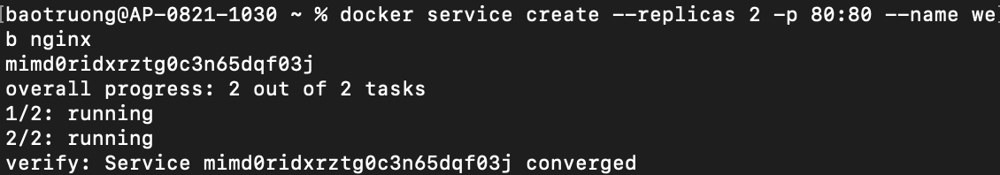

5. Similar to the docker ps command, you can see a listing of the services running on your cluster with the **docker service ls command**. view the containers currently running on your swarm, use the docker service ps command with the name of your service, **web**:

```
docker service ps web
```

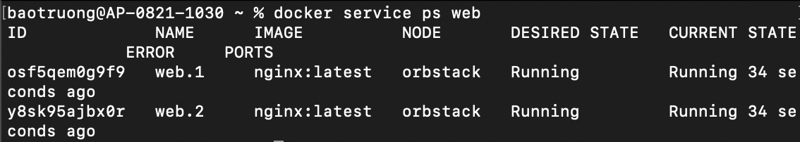

6. The service will only run the default Welcome to nginx! page. Use the node IP address to view the page.

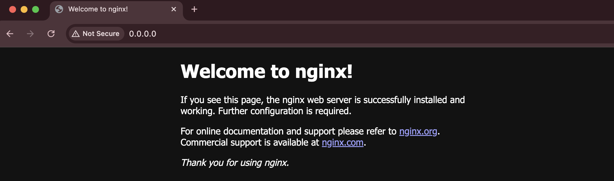

7. Scaling the number of containers running your service is easy with Docker Swarm. Simply provide the **scale** option with the number of total containers you want to have running, and the swarm will do the work for you. Perform the command shown here to scale your running web containers to 3:

```
docker service scale web=3
```

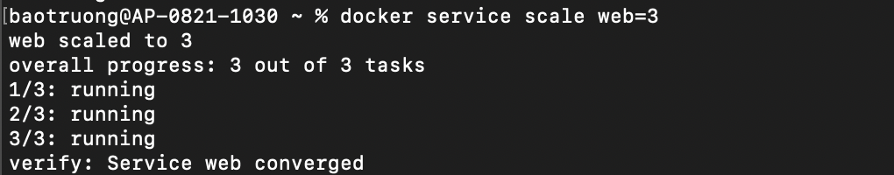

8. Run the service ls command:

```
docker service ls
```

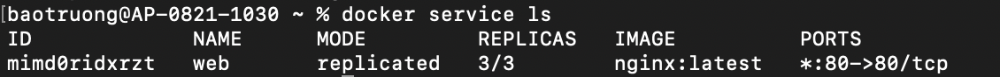

9. The following change is more suited to a cluster with more than one node, but you can run it anyway to see what happens. Run the following node update command to set the availability to **drain** and use your node ID number or name. This will remove all the containers running on this node as it is no longer available on your cluster. You will be provided with the node ID as an output:

```
docker node update --availability drain <your node ID number>
```

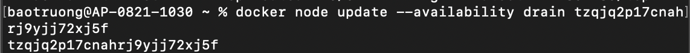

10. Running **docker service ps web** shows your web services shutting down and restarting repeatedly.

```
docker service ps web
```

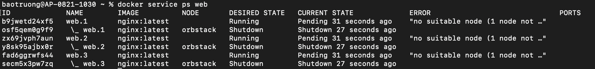

11. Run the command **docker node ls** to see the status of your node:

```
docker node ls
```

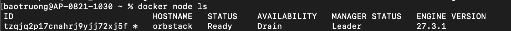

This shows that your node is ready but in an AVAILABILITY state of **Drain**

12. Stop the service from running. Use the service rm command, followed by the service name (for this lab, web) to stop the service from running:

```
docker service rm web
```


13. You don't want to leave your node in a Drain state as you want to keep using it through the rest of the lab. To get the node out of a Drain state and prepare to start managing swarm, set the availability to active with the following command using your node ID:

```
docker node update --availability active <your node ID number>
```

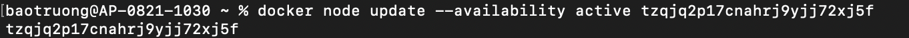

14. Run the node ls command again to see the availability of your node:

```
docker node ls
```

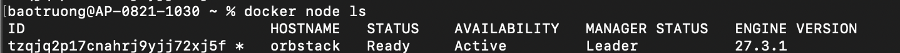

15. Use the docker node inspect command with the **--format** option and search for the **ManagerStatus.Reachability** status to ensure that your node is reachable:

```
docker node inspect <your node Id number> --format "{{.ManagerStatus.Reachability }}
```

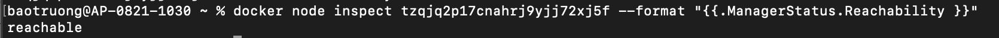

If the node is available and can be contacted, you should see a result of **reachable**.

16. Search for **Status.State** to ensure that the node is ready:

```
docker node inspect <your node Id number> --format "{{.Status.State }}
```

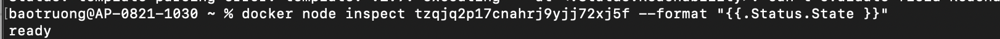

This should produce **ready**.

17. Let's finish by running the command to force the node leave the cluster:

```
docker swarm leave --force
```

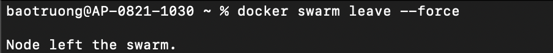


