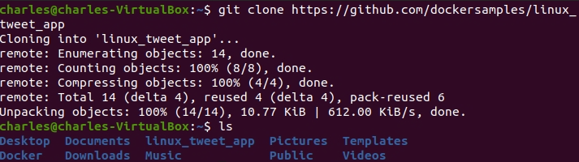
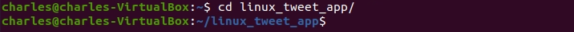
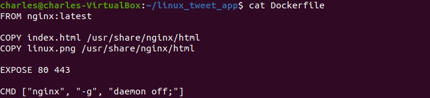
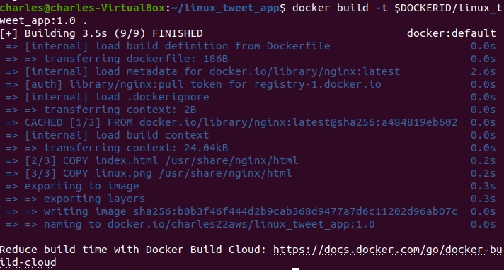
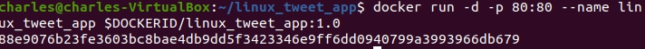
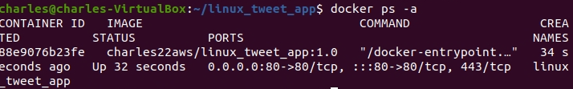
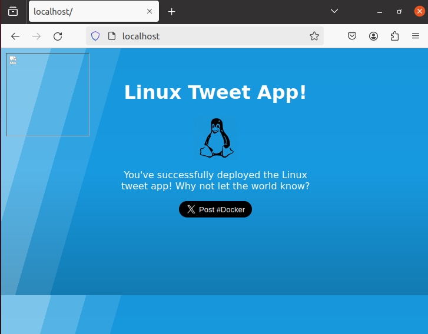
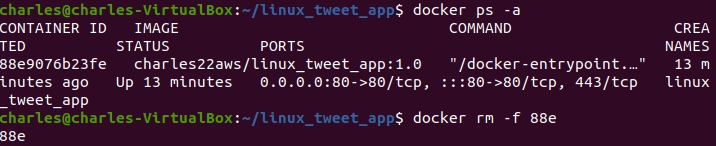
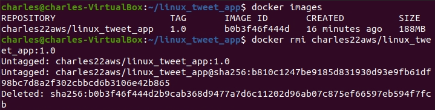

# Introduction

In this lab, we will look at some basic Docker commands and a simple build-ship-run workflow. We’ll start by running some simple containers, then we’ll use a Dockerfile to build a custom app.

You also need to have a `Docker Hub account` to do this lab.

You can refer to the detailed instructions [here](https://training.play-with-docker.com/beginner-linux/).

1. First, clone the repository using the following command.

```
git clone https://github.com/dockersamples/linux_tweet_app
```



2. Then navigate to the linux_tweet_app folder.

```
cd ~/linux_tweet_app/
```



3. View the Dockerfile.

```
cat Dockerfile
```



```
 FROM nginx:latest

 COPY index.html /usr/share/nginx/html
 COPY linux.png /usr/share/nginx/html

 EXPOSE 80 443     

 CMD ["nginx", "-g", "daemon off;"]
```
Let’s see what each of these lines in the Dockerfile do.

- [FROM](https://docs.docker.com/engine/reference/builder/#from) specifies the `base image` to use as the starting point for this new image you’re creating. For this example we’re starting from `nginx:latest`.
  
- [COPY](https://docs.docker.com/engine/reference/builder/#copy) copies files from the Docker host into the image, at a known location. In this example, `COPY` is used to copy two files into the image: `index.html`. and a graphic that will be used on our webpage.
  
- [EXPOSE](https://docs.docker.com/engine/reference/builder/#expose) documents which ports the application uses.
  
- [CMD](https://docs.docker.com/engine/reference/builder/#cmd) specifies what command to run when a container is started from the image. Notice that we can specify the command, as well as run-time arguments.

4. You will have to manually type this command as it requires your unique `DockerID` (Docker Hub username). 

```
export DOCKERID=<your docker id>
```

5. Echo the value of the variable back to the terminal to ensure it was stored correctly.

```
echo $DOCKERID
```

6. Use the docker build command to create a new `Docker image` using the instructions in the `Dockerfile`.

```
docker build -t $DOCKERID/linux_tweet_app:1.0 . 
```

- `-t` allows us to give the image a custom name. In this case it’s comprised of our DockerID, the application name, and a version. Having the Docker ID attached to the name will allow us to store it on Docker Hub in a later step
  
- `.` tells Docker to use the current directory as the build context (the current directory which has Dockerfile) .Be sure to include period (.) at the end of the command.



7. Use the `docker run` command to start a new container from the image you created.

```
docker run -d -p 80:80 --name linux_tweet_app $DOCKERID/linux_tweet_app:1.0
```



As this container will be running an NGINX web server, we’ll use the `-p` flag to publish port 80 inside the container onto port 80 on the host. This will allow traffic coming in to the Docker host on port 80 to be directed to port 80 in the container. The format of the `-p` flag is `host_port:container_port`.

8. Use `docker ps -a` to see the running container.

```
docker ps -a
```



9. Access the web browser and type the following command to load the website

```
localhost:80
```



10. Once you’ve accessed your website, shut it down and remove it. Follow these steps in picture to remove the container and image.

```
docker rm -f linux_tweet_app
```
We use the `-f` parameter to remove the running container without shutting it down. This will ungracefully shutdown the container and permanently remove it from the Docker host.



