# Introduction

Imagine a scenario where you have built Docker images and containers that you would be interested to keep and share it with your other collaborators or colleagues. The below methods shall help you achieve it.

Four basic Docker CLI comes into action:
- The [docker export](https://docs.docker.com/reference/cli/docker/container/export/) - Export a container’s filesystem as a tar archive
- The [docker import](https://docs.docker.com/reference/cli/docker/image/import/) - Import the contents from a tarball to create a filesystem image
- The [docker save](https://docs.docker.com/reference/cli/docker/image/save/)   - Save one or more images to a tar archive (streamed to STDOUT by default)
- The [docker load](https://docs.docker.com/reference/cli/docker/image/load/)   - Load an image from a tar archive or STDIN

1. Create a Nginx container.

```
docker run -d -p 80:80 nginx
```

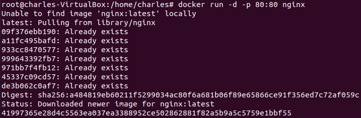

2. Display running container.

```
docker ps -a
```

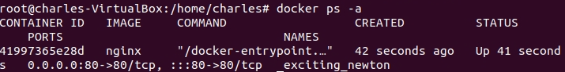

3. Export the filesystem of a Docker container to a tar archive.

```
docker export <containerID> > nginx.tar
```

- `containerID`: This is the ID of the Docker container you want to export. You would replace `containerID` with the actual ID of your container.

- `nginx.tar`: This is the name of the file where the exported Docker container filesystem will be saved. It will be in the `tar` format.

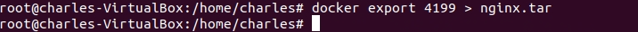

4. You could commit this container as a new image locally, but you could also use the `docker import` command:

```
docker import - nginx-devops < nginx.tar
```

- `-`: This is a placeholder for the tar archive’s source. In this case, it indicates that the tar archive will be read from the standard input (stdin)

- `nginx-devops`: This is the name you want to give to the new Docker image.

- `nginx.tar`: This is the name of the tar archive file that contains the filesystem to be imported.

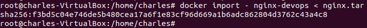

5. Use the `docker images` command to list all the images.

```
docker images
```

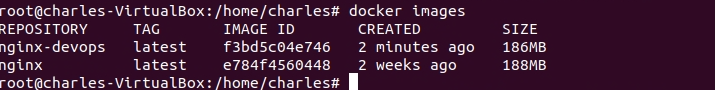

6. If you wanted to share this image with one of your collaborators, you could upload the tar file on a web server and let your collaborator download it and use the import command on his Docker host. If you would rather deal with images that you have already committed, you can use the load and save commands:

```
docker save -o mynginx.tar nginx
```

- `-o mynginx.tar`: This option specifies the `output file`. In this case, the output file is mynginx.tar

- `nginx`: This is the name of Docker image you want to save in the mynginx.tar file

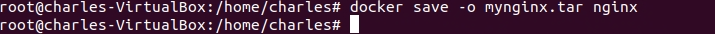

7. Use the `ls -l` to list all the files. You can see our two files named nginx.tar and mynginx.tar.

```
ls -l
```

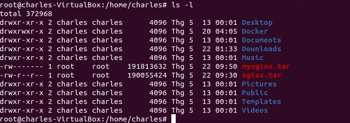

8. Now, let's remove our `nginx-devops` image.

```
docker rmi nginx-devops
```

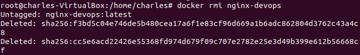

9. Then delete all images and containers running.

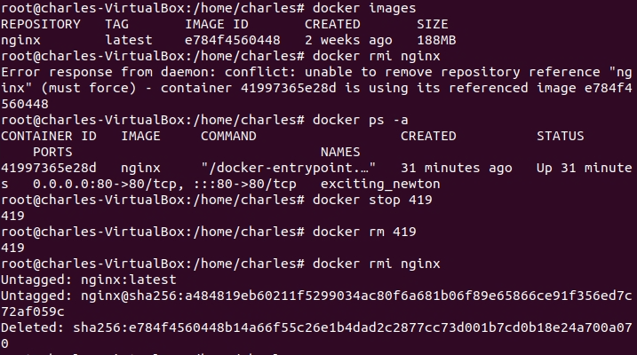

10. Let's load the Docker image into your system.

```
docker load < mynginx.tar
```

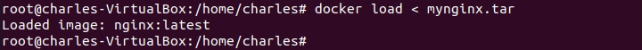

11. You can check our new iamge by using the docker images command.

```
docker images
```

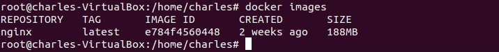

