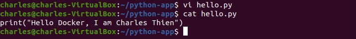
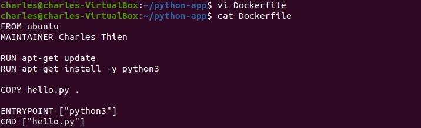
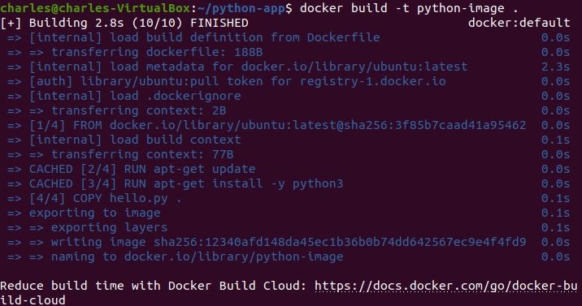
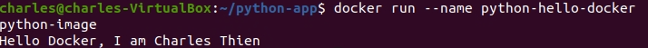
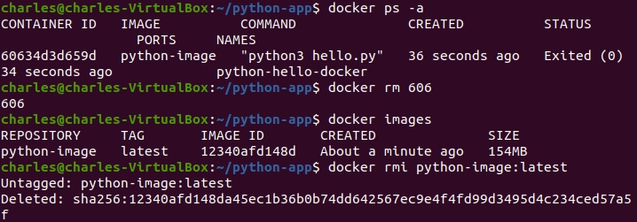

# Introduction

In this lab, you will learn how to write a Dockerfile for python

1. Prepare our workspace. Make a directory and call it `python-app`, then navigate to it.

```
mdkir python-app && cd python-app
```


2. In the python-app folder, create a file and name it `hello.py`.

```
vi hello.py
```

- Code for hello.py
```
print("Hello Docker, I am Charles Thien")
```



3. Create a Dockerfile

```
vi Dockerfile
```

Dockerfile:
```
FROM ubuntu
MAINTAINER Charles Thien
RUN apt-get update
RUN apt-get install -y python3

COPY hello.py .
ENTRYPOINT ["python3"]
CMD ["hello.py"]
```

- `FROM ubuntu`: This line specifies the `base image` that will be used for the Docker container. In this case, it’s using the ubuntu image from `Docker Hub`.

- `RUN apt-get update`: This line updates the list of packages in the Ubuntu image to ensure that the latest versions of the packages are installed.

- `RUN apt-get install -y python3`: This line installs `Python 3` on the Ubuntu image. The -y flag automatically answers ‘yes’ to any prompts that come up during the installation process.

- `COPY hello.py .`: This line copies the hello.py file from your local directory (where the Dockerfile is located) into the Docker image. The `.` indicates that the file is being copied to the root directory of the Docker image.

- `ENTRYPOINT ["python3"]`: This line specifies the command that will be run when the Docker container is started. In this case, it’s set to run `python3`.

- `CMD ["hello.py"]`: This line provides default arguments that will be included in the ENTRYPOINT command when the Docker container is run.



4. Now, we are building a Docker image based on the instructions from the Dockerfile

```
docker build -t python-image .
```



5. Run a container from a Docker image we just created.

```
docker run --name python-hello-docker python image
```



6. You have successfully run a container from the Docker image. Now, following these steps to remove containers and images.

