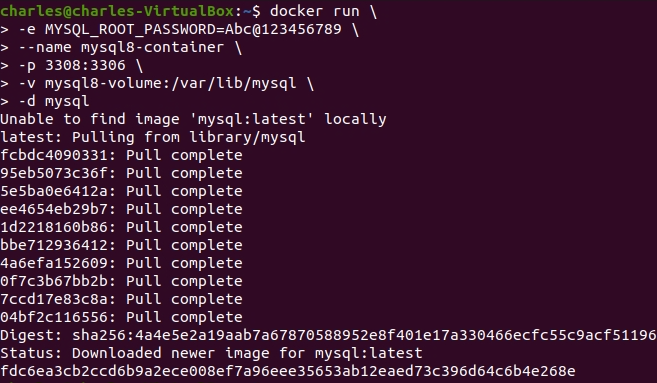

# Introduction

In this part, you will learn how to interact with MySQL Docker.

1. Let's run a MySQL container by using the following command.

```
docker run \
-e MYSQL_ROOT_PASSWORD=Abc@123456789 \
--name mysql8-container \
-p 3308:3306 \
-v mysql8-volume:/var/lib/mysql \
-d mysql
```

Let’s break down the docker run command I provided:
- `docker run`: This is the command to run a Docker container.

- `-e MYSQL_ROOT_PASSWORD=Abc@123456789`: This flag sets the `environment variable` MYSQL_ROOT_PASSWORD to the specified value (Abc@123456789). It’s used to set the `root password` for the MySQL database inside the container.

- `--name mysql8-container`: we specify the name of the running container is `mysql8-container`.

- `-p 3308:3306`: This flag maps port 3308 on your host machine to port 3306 inside the container. This means you can access the MySQL server running in the container via port 3308 on your host.

- `-v mysql8-volume:/var/lib/mysql`: This flag creates a volume named `mysql8-volume` and mounts it to the `/var/lib/mysql` directory inside the container. Volumes are used to persist data between container restarts.

- `-d mysql`: The `-d` flag runs the container in `detached mode` (in the background). The `mysql` (latest version) argument specifies the Docker image to use for the container.

