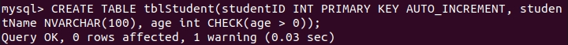

# Introduction

In this part, you will learn how to interact with MySQL Docker.

1. Let's run a MySQL container by using the following command.

```
docker run \
-e MYSQL_ROOT_PASSWORD=Abc@123456789 \
--name mysql8-container \
-p 3308:3306 \
-v mysql8-volume:/var/lib/mysql \
-d mysql
```

Let’s break down the docker run command I provided:
- `docker run`: This is the command to run a Docker container.

- `-e MYSQL_ROOT_PASSWORD=Abc@123456789`: This flag sets the `environment variable` MYSQL_ROOT_PASSWORD to the specified value (Abc@123456789). It’s used to set the `root password` for the MySQL database inside the container.

- `--name mysql8-container`: we specify the name of the running container is `mysql8-container`.

- `-p 3308:3306`: This flag maps port 3308 on your host machine to port 3306 inside the container. This means you can access the MySQL server running in the container via port 3308 on your host.

- `-v mysql8-volume:/var/lib/mysql`: This flag creates a volume named `mysql8-volume` and mounts it to the `/var/lib/mysql` directory inside the container. Volumes are used to persist data between container restarts.

- `-d mysql`: The `-d` flag runs the container in `detached mode` (in the background). The `mysql` (latest version) argument specifies the Docker image to use for the container.


2. Let's execute a shell (bash) inside a running MySQL container.

```
docker exec -it mysql8-container bash
```


3. Use the following command to connect to the MySQL shell. 

```
mysql -u root -p
```


4. Use the following command to interact with MySQL.

```
CREATE DATABASE TestDB;
```
- Create a database named `TestDB`


```
USE TestDB;
```
- The `USE TestDB;` command in MySQL is used to select a database (with the name `TestDB`) as the default (current) database for subsequent statements.


```
CREATE TABLE tblStudent (
		studentID INT PRIMARY KEY AUTO_INCREMENT,
		studentName NVARCHAR(100),
		age int CHECK(age > 0)
);
```

Here, we create a table named `tblStudent` with the following columms:
- `studentID`: An integer column designated as the `primary key`. The `AUTO_INCREMENT` attribute ensures that each new row inserted into this table will automatically receive a unique value for studentID.

- `studentName`: A column of type `NVARCHAR(100)` (which typically stores Unicode text) to hold student names.

- `age`: An integer column with a check constraint `(CHECK(age > 0))`. This constraint ensures that the age value must be **greater than zero**.



```
SELECT * FROM tblStudent;
```

Use this command to retrieve data from the `tblStudent` table. After running the command, you will see that the table doesn’t have any data, as we haven’t inserted anything into it.


```
INSERT INTO tblStudent(studentName, age)
VALUES('Charles Thien', 19);
```

- `INSERT INTO tblStudent(studentName, age)`: This part specifies the table name (tblStudent) and the columns into which we want to insert data (studentName and age).

- `VALUES('Charles Thien', 19)`: Here, we provide the actual values to be inserted. 'Charles Thien' will be inserted into the `studentName` column, and 19 will be inserted into the `age` column.


```
SELECT * FROM tblStudent;
```

Now, let's run this command again to see the result.


5. Type exit to exit the bash of the MySQL and the terminal of the container.

```
exit
```


6. Type `docker volume ls` to see the volume. We can see our mysql8-volume volume.

```
docker volume ls
```


7. Now, let's remove our container, image and volume. Following these steps to perform this action.


