# Introduction

In this lab, you will learn how to create a volume. You should than run a simple an thin container and attach a volume to it. Use the image selaworkshops/busybox:latest and use any name to the mounted volume directory. 

## Explain about the volume types

There are `two types` of volume.

Every volume is a mount point on the container directory tree to a location on the host directory tree, but the types differ in where that location is on the host.

- The first type of volume is a `bind mount`. Bind mount volumes use any `user-specified directory` or `file` on the `host OS`.

- The second type is a `managed volume`. Managed volumes use `locations that are created by the Docker daemon` in space controlled by the daemon, called `Docker managed space`.

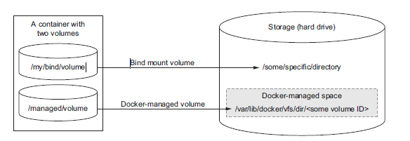

### Docker managed volumes
Managed volumes are different from bind mount volumes because the Docker daemon creates managed volumes in a portion of the host’s file system that’s owned by Docker. 

Managed volumes are created when you use the `-v` option (or `--volume`) on docker run but `only specify the mount point in the container directory tree`.

1. Create a new volume and call it `my-volume`.

```
docker volume create my-volume
```

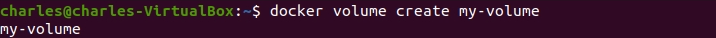

2. Inspect the new volume to find the `mountpoint`.

```
docker inspect my-volume
```

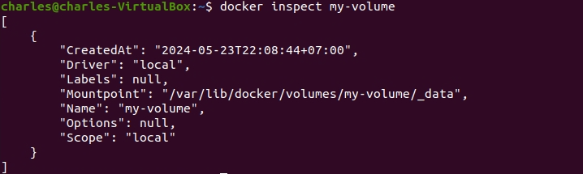

3. Let’s run a container and mount the created volume to the root.

```
docker run -it -v my-volume:/data --name my-devops-container selaworkshops/busybox:latest
```

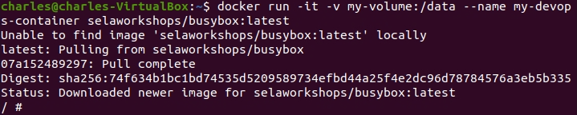

4. In the terminal of the container, create a new file under /data.

```
cd /data/
echo "Devops" > hi.txt
ls
``` 


5. Open other terminal instance and run other container with the same volume.

```
docker run -it -v my-volume:/data --name my-devops-container-2 selaworkshops/busybox:latest
```

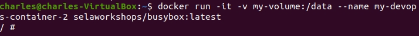

6. In the terminal of the my-devops-container-2 container, type the following command.

```
cd data/ && ls
```

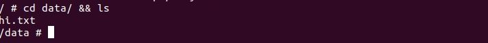

7. Exit from both containers and delete them. Use the following command to force remove the container.

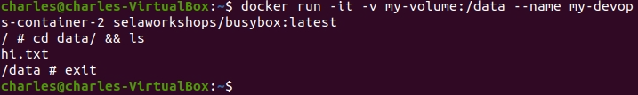

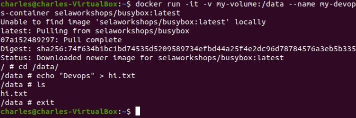

```
docker rm -f my-devops-container my-devops-container-2
```

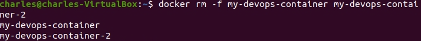

8. Ensure the containers were deleted.

```
docker ps -a
```


9. Delete the image.

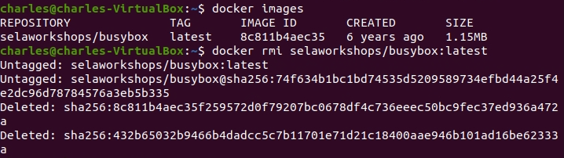

### Bind mount volumes

Bind mount volumes are useful when the host provides some file or directory that needs to be mounted into the container directory tree at a specific point.

Note: Volume được gắn vào theo kiểu `bind mount` sẽ tạo mới đường dẫn được gắn hoặc nếu có đường dẫn rồi thì `ghi đè toàn bộ dữ liệu`.

1. Make a directory and name it `devops-docs`.

```
mkdir devops-docs
```

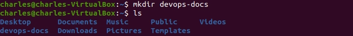

2. Type the following command to start an Apache HTTP server where your new directory (devops-docs) is bind mounted to the server's document root.

```
docker run -d --name devopsweb -v ~/devops-docs:/usr/local/apache2/htdocs -p 80:80 httpd:latest
```

Here’s what each part of the command does:
- `-d`: Run a `detached mode` container.

- `--name`: we specify the name of the container is `devopsweb`.   

- `-v ~/devops-docs:/usr/local/apache2/htdocs`: This option mounts the local directory ~/devops-docs (on your host machine) to the directory /usr/local/apache2/htdocs inside the Docker container. Any changes made in the local directory will be reflected inside the container, and vice versa.
   - `~/devops-docs`: The host volume on your local machine
  
   - `/usr/local/apache2/htdocs`: The volume of the container

- `-p 80:80`: This option maps port 80 of your host machine to port 80 of the Docker container.

- `httpd:latest`: This is the image that the Docker container is based on. In this case, it’s the latest version of the httpd image, which is a Docker image that runs an Apache HTTP server.

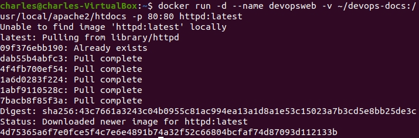

3. Check the volume being mounted in the container with the following command.

```
docker inspect -f '{{ .Mounts }}' devopsweb
```

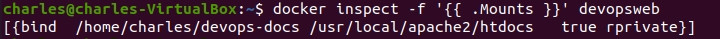

4. Another way to check the volume.

```
docker inspect devopsweb
```

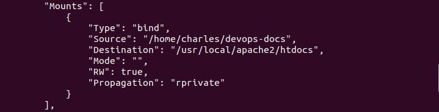

Notes: This example touches on an important attribute or feature of volumes. When you mount a volume on a container file system, it replaces the content that the image provides at that location. This behavior is the basis for the polymorphic container pattern.

Expanding on this use case, suppose you want to make sure that the Apache HTTP web server can’t change the contents of this volume.

Fortunately, Docker provides a mechanism to mount volumes as `read-only`. You can do this by appending `:ro` to the volume map specification.

5. Type the following command to force Docker to remove the container named `devopsweb` and its associated volumes, even if the container is running.

```
docker rm -rf devopsweb
```


6. You should change the run command to something like the following.

```
docker run -d --name devopsweb2 -v ~/devops-docs:/usr/local/apache2/htdocs/:ro -p 80:80 httpd:latest
```

So, in summary, this command starts a new Docker container named devopsweb2, running an Apache HTTP server, with the local directory ~/devops-docs mounted as a `read-only` volume to /usr/local/apache2 htdocs inside the container, and the web server is accessible via port 80 on the host machine.

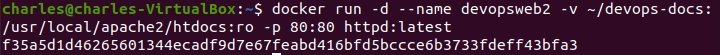

7. By mounting the volume as read-only, you can prevent any process inside the container from modifying the content of the volume. You can see this in action by running a quick test using the following command.

```
docker run --rm -v ~/devops-docs:/testspace:ro alpine /bin/sh -c 'echo test > /testspace/test'
```

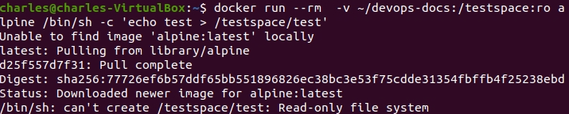

This command starts a container with a similar read-only bind mount as the web server. It runs a command that tries to add the word test to a file named test in the volume. The command `fails` because the volume is mounted as `read-only`.

8. End this lab, please follow these steps to delete the containers and images.

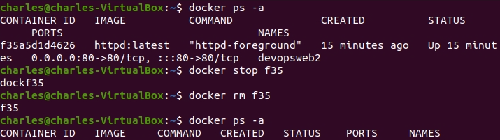

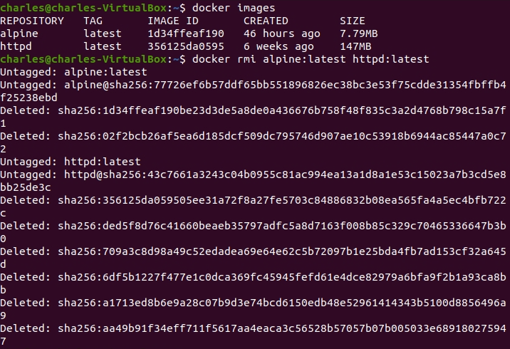
# Conclusion

## Bind mount volumes

You can use **bind mount volumes** to `mount individual files`. This provides the flexibility to create or link resources at a level that avoids conflict with other resources.

+ Advantages:
  - Bind mount volumes are **useful** if you want to `share data` with other processes running outside a container, such as components of the host system itself.
  
  - The important thing to note in this case is that `the file must exist on the host` before you create the container.
  
  - Bind mount volumes are `appropriate tools` for workstations or machines with `specialized concerns`.
  
+ Disadvantages:
  - The first problem with bind mount volumes is that they tie otherwise portable container descriptions to the file system of a specific host.
  
  - The next big problem is that they create an opportunity for `conflict with other containers`.

## Docker managed volumes

Using managed volumes is a method of `decoupling volumes` from specialized locations on the file system.

Ngữ cảnh sử dụng `docker mananged volume` trong trường hợp muốn `đồng bộ thư mục` giữa `host` và `container` mà ko `xóa dữ liệu cũ` trong container đang có.
