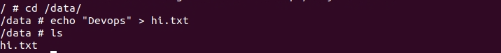

# Introduction

In this lab, you will learn how to create a volume. You should than run a simple an thin container and attach a volume to it. Use the image selaworkshops/busybox:latest and use any name to the mounted volume directory. 

1. Create a new volume and call it `my-volume`.

```
docker volume create my-volume
```


2. Inspect the new volume to find the `mountpoint`.

```
docker inspect my-volume
```


3. Let’s run a container and mount the created volume to the root.

```
docker run -it -v my-volume:/data --name my-devops-container selaworkshops/busybox:latest
```


4. In the terminal of the container, create a new file under /data.

```
cd /data/
echo "Devops" > hi.txt
ls
``` 



5. Open other terminal instance and run other container with the same volume.

```
docker run -it -v my-volume:/data --name my-devops-container-2 selaworkshops/busybox:latest
```


6. In the terminal of the my-devops-container-2 container, type the following command.

```
cd data/ && ls
```


7. Exit from both containers and delete them. Use the following command to force remove the container.


```
docker rm -f my-devops-container my-devops-container-2
```


8. Ensure the containers were deleted.

```
docker ps -a
```


9. Delete the image.

