# Overview

## Bridge network
In terms of Docker, a bridge network uses a software bridge which lets containers connected to the same bridge network communicate, while providing isolation from containers that aren't connected to that bridge network. The Docker bridge driver automatically installs rules in the host machine so that containers on different bridge networks can't communicate directly with each other.

Bridge networks apply to containers running on the `same Docker daemon host`.

### Use the default bridge network

In this part, you will learn how to use the `default bridge` network that Docker sets up for you automatically. This network is `not the best choice` for production systems.

1. Open the terminal, type the following command to list the current networks:

```
docker network ls
```


2. Run the following command to run two alpine containers running `ash`, which is Alpine's default shell rather than `bash`.

```
docker run -dit --name alpine1 alpine ash

docker run -dit --name alpine2 alpine ash
```

The `-dit` flag means to run the container on detached mode (in the background), interactive and with a TTY (so you can see the input and output).

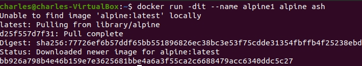


3. Check that both containers are actually started by using the following command:

```
docker ps -a
```

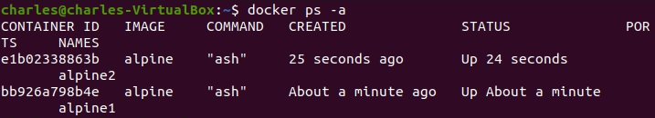

4. Use the following command to inspect the `bridge` network:

```
docker inspect bridge
```

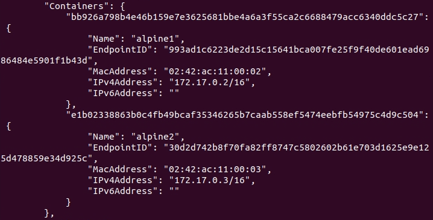

Under the `Containers` key, each connected container is listed, along with information about its IP address (172.17.0.2 for alpine1 and 172.17.0.3 for alpine2).

5. The containers are running in the background. Use the `docker attach` command to connect to `alpine1`.

```
docker attach alpine1
```


The prompt changes to `#` to indicate that you are the `root user` within the container. 

6. Use the `ip addr show` command to show the network interfaces for alpine1 as they look from within the container: 

```
ip addr show
```

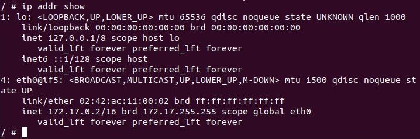

7. From within `alpine1`, make sure you can connect to the internet by pinging `aws.amazon.com`.

```
ping -c 2 aws.amazon.com
```

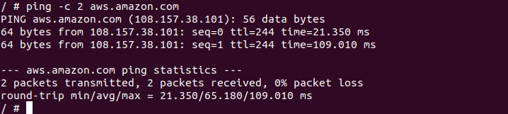

8. Now try to ping the `second container`. First, ping it by its IP address, `172.17.0.3`:

```
ping -c 2 172.17.0.3
```

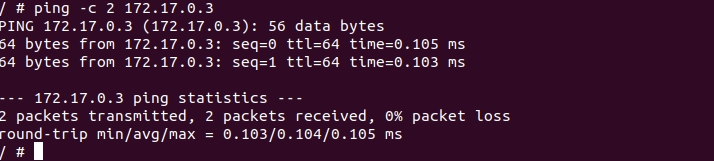

9. This succeeds. Next, try pinging the `alpine2` container by container name. This will fail.

```
ping -c 2 alpine2
```


10.  Detach from alpine1 without stopping it by using the detach sequence, hold down CTRL and type p followed by q.

11. Follow these steps to remove the containers and images.

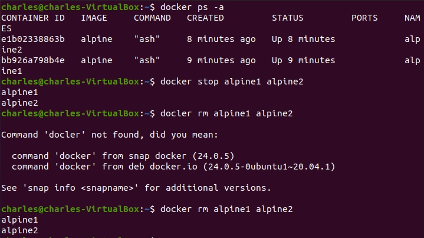

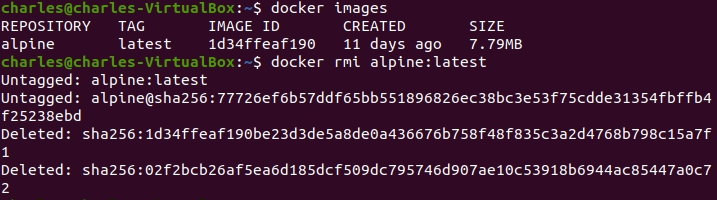

### Use user-defined bridge networks

In this example, we again start two alpine containers, but attach them to a `user-defined network` called `alpine-net` which we have already created. These containers are not connected to the default bridge network at all. We then start a third alpine container which is `connected to the bridge network` but `not connected to alpine-net`, and a `fourth` alpine container which is `connected to both networks`.

1. Create the `alpine-net` network.

```
docker network create -d bridge alpine-net
```


2. List Docker's networks using the following commad:

```
docker network ls
```

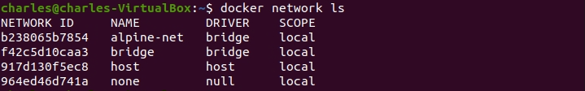

3. Inspect the alpine-net network:

```
docker inspect alpine-net
```

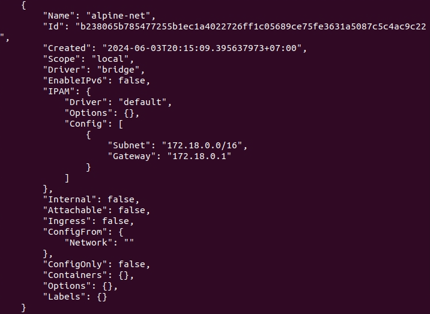

Notice that this network's gateway is `172.18.0.1`, as opposed to the default bridge network, whose gateway is `172.17.0.1`.

4. Create your four containers. Notice the --network flags.

```
docker run -dit --name alpine1 --network alpine-net alpine ash

docker run -dit --name alpine2 --network alpine-net alpine ash

docker run -dit --name alpine3 alpine ash

docker run -dit --name alpine4 --network alpine-net alpine ash

docker network connect bridge alpine4
```

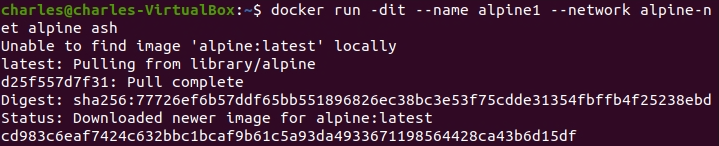

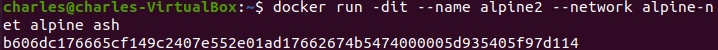


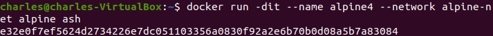


5. Verify that all containers are running:

```
docker ps 
```

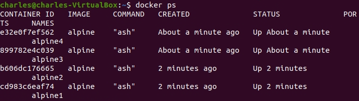

6. Inspect the `bridge` network and the `alpine-net` network again:

```
docker inspect bridge
```

```
docker inspect alpine-net
```

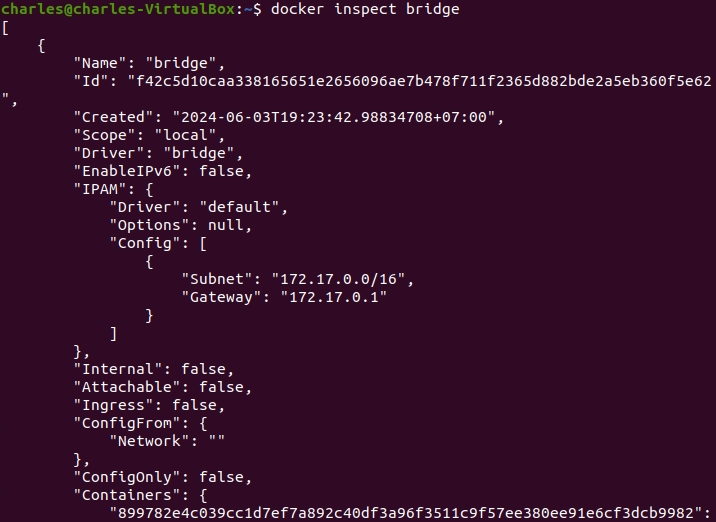

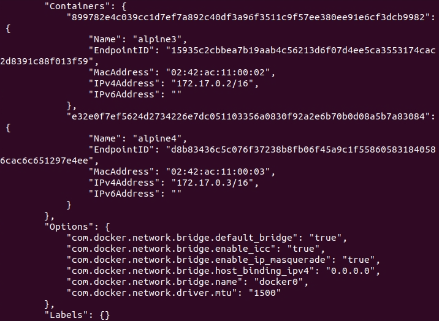

Containers `alpine3` and `alpine4` are connected to the `bridge` network.

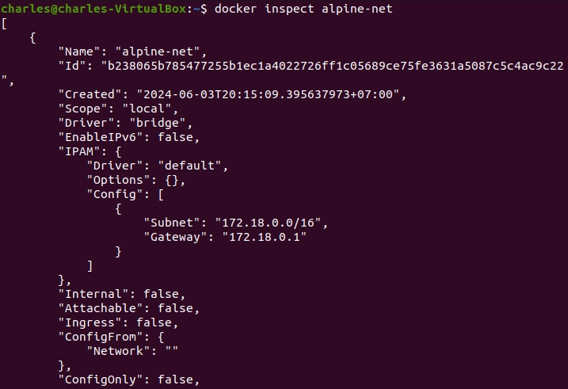

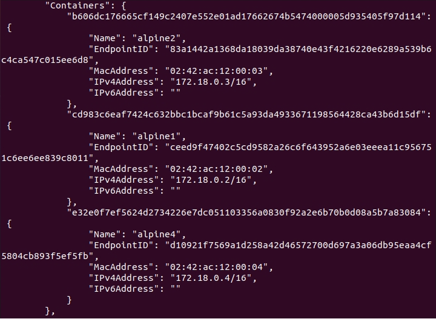

Containers `alpine1`, `alpine2` and `alpine4` are connected to the `alpine-net` network.

7. Use the `docker attach` command to connect to `alpine1`.

```
docker attach alpine1
```


8. Ping to the container named `alpine2`, `alpine4` and `alpine3`.

```
ping -c 2 alpine2
```

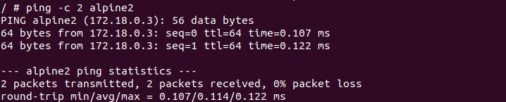

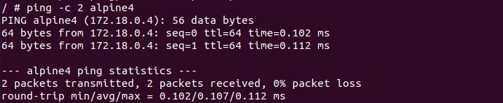

From alpine1, you should not be able to connect to alpine3 at all, since it is not on the `alpine-net` network.


9. Ping to alpine3 by its IP address.

```
ping -c 2 172.17.0.2
```

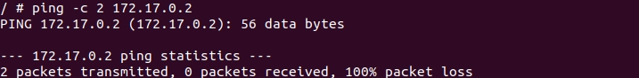

However, you will need to address `alpine3` by its IP address.

10. Use the `docker attach` command to connect to `alpine4`.

```
docker attach alpine4
```


11. Perform ping to other container.

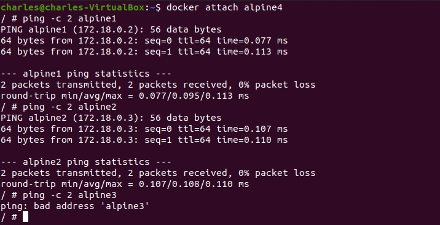

12.  Type `Ctrl + pq` to exit the shell.


13. Follow the following steps to remove the containers and images.

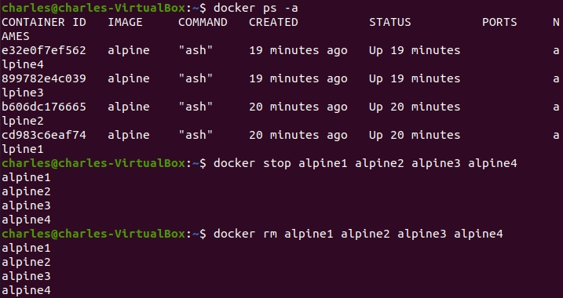

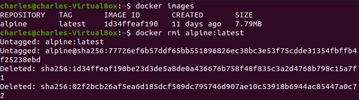