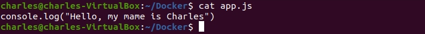
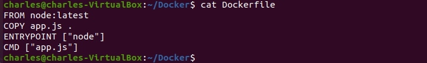
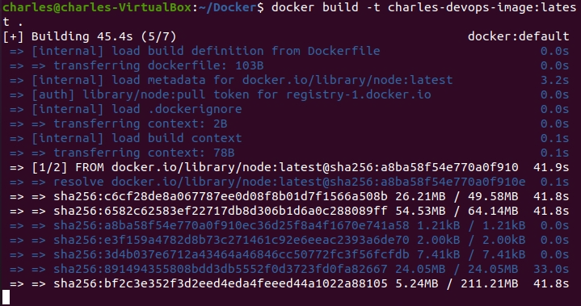
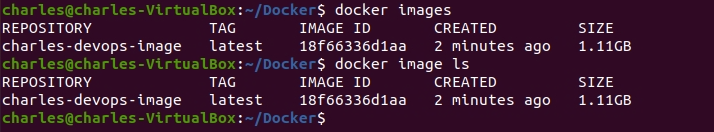
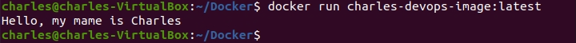

# Introduction

In this lab, we will learn how to create a Dockerfile for a simple Node.js application. Plus, we also push our Docker image to the Docker Hub so you also need to have a Docker Hub account to do this lab.

Follow the following guides to create a [Docker Hub account](https://hub.docker.com/signup/) 

1. First, let's create a directory and name it `docker`, then navigate to it using the `cd` command.

```
mkdir docker && cd docker
```


2. Create a `app.js` file with the following content.

```
console.log("Hello, my name is Charles")
```



3. Create a `Dockerfile` with the following content.

```
FROM node:latest
COPY app.js .
ENTRYPOINT ["node"]
CMD ["app.js"]
```
Here,
- `FROM node:latest`: we define our base image is the node image version latest.
- `COPY app.js .`: `COPY app.js .` command in Dockerfile means copying the app.js file from the host machine (the machine you are running the docker build command on) to the current working directory in the Docker image (the current working directory here is `docker`).
- `ENTRYPOINT ["node"]`: means that when we run the container, Docker will automatically run the node command.
- `CMD ["app.js"]`: When you run the container, Docker will execute the node app.js command, meaning it will run the app.js file using Node.js.



4. Now,  use the `docker build` command to create a `Docker image` based on the instructions from the `Dockerfile`. 

```
docker build -t charles-devops-images:latest .
```

- The `docker build` command is used to build a Docker image based on the instructions from the Dockerfile
- `-t charles-devops-images:latest`: The `-t` option allows me to name (tag) the image I am building. In this case, I name the image charles-devops-images and set the tag as `latest`.
- `.`: This is the path to the directory (docker folder) containing the Dockerfile you want Docker to use to build the image.



5. After you run the `docker build` command successfully, you can check the image we just created by using the `docker images` or `docker image ls` commands.

```
docker images
```

```
docker image ls
```



6. So now, we already have a Docker image. We can run it by using the `docker run` command.

```
docker run charles-devops-image:latest
```

